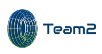

 
 
 
 
 

## Introduction

* The major goal of this team project is to generate enhanced architecture desigin finally after executing the below steps. 
   * Choose one among popular target systems (e.g., personnalization) 
      * Target system: Personalization, Fitts (https://www.fitts.co.kr)
   * Milestone: https://github.com/skkuse-adv/2019Fall_team2/milestones
      * :necktie: Milestone 1: Write the proposal document after analyzing briefly target system
      * :necktie: Milestone 2: Write the system requirement document for a requirement specification
      * :necktie: Milestone 3: Write the system design document for a target system architecture
      * :necktie: Milestone 4: Write the enhanced system design based on ADD to propose new architecture model finally.
         * :page_with_curl: Kanban Board: [[M4] ADD-based Fitts System Design](https://github.com/skkuse-adv/2019Fall_team2/projects/1)


## Members
| Full Name   | GitHub ID   | E-mail                        | R&R |
|-------------|-------------|-------------------------------|---------------------------------|
| 빙          | beandkay    | tinyswish@gmail\.com          | Design, Analysis, Documentation, System Requirement,  Review Input, ADD-iteration3, GitHub Issue, Review&Merging |
| 임근식       | leemgs     | leemgs@gmail\.com             | Design, Analysis, Documentation, Reverse Engineering, Design Purpose,ADD-iteration1&2,  Review&Merging |
| 하지크       | ajid951125 | haziqhamzah951125@gmail\.com  | Design, Analysis, Documentation, System Requirement, ADD-iteration4, Review&Merging |
| 장한빈       | JangHanBin | espoirnoa09@gmail\.com        | - |


## Repository Structure

```bash
PROJECT ROOT
.
|-- README.md (This file)
|-- analysis (decompiling the mobile applications, Generating pseudo codes, Restoring resource files, and so on)
|   `-- reverse-engineering
|       |-- decompile-fitts-20191031-2200 (Resource-based decompilation)
|       |   |-- resources
|       |   `-- sources
|       `-- decompile-fitts-with-gradle-20191031-2200 (Gradle-based decompilation)
|           |-- build.gradle
|           `-- src
|
 `-- docs
     `-- Milestone1: Proposal.pptx  
     `-- Milestone2: Requirement Specification.docx 
     `-- Milestone3: System Design.docx
     `-- Milestone4: ADD Iteration Final.docx (ADD-based Architecture Model) 
```

## Terminology
* SD: System Design
* TBA: To Be Appended
* TBD: To Be Defined
* WIP: Work-In-Progress
* M: Milestone (e.g., M1, M2, M3, and M4)
